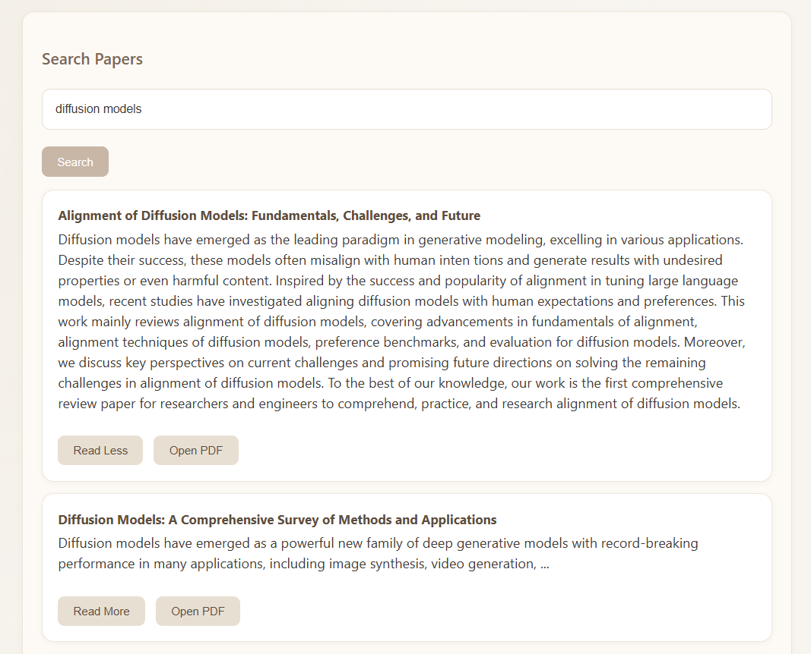
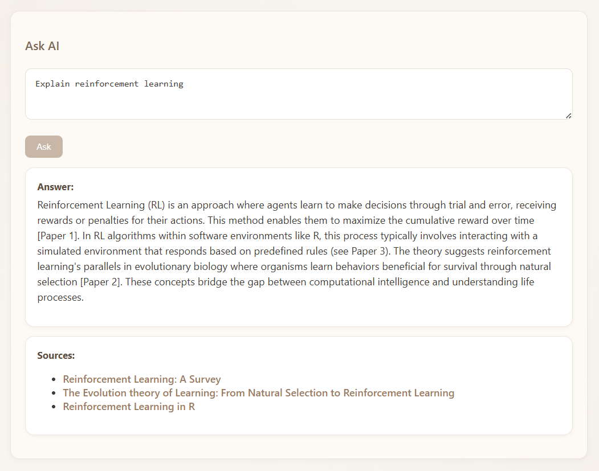
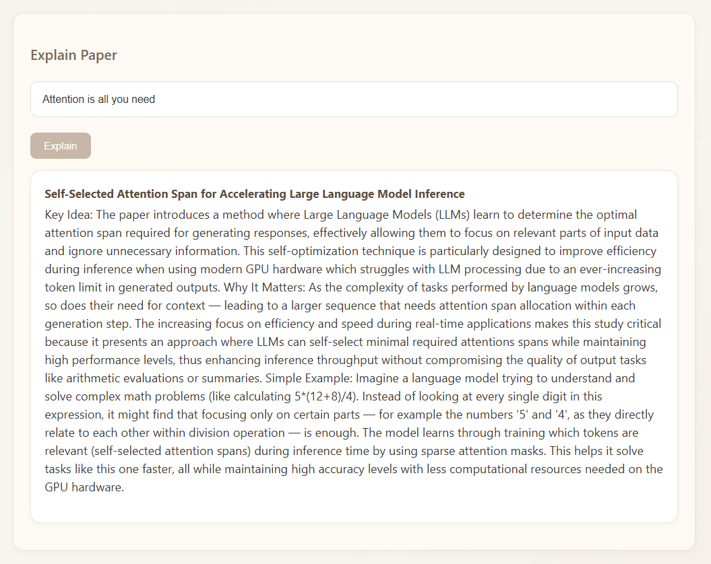
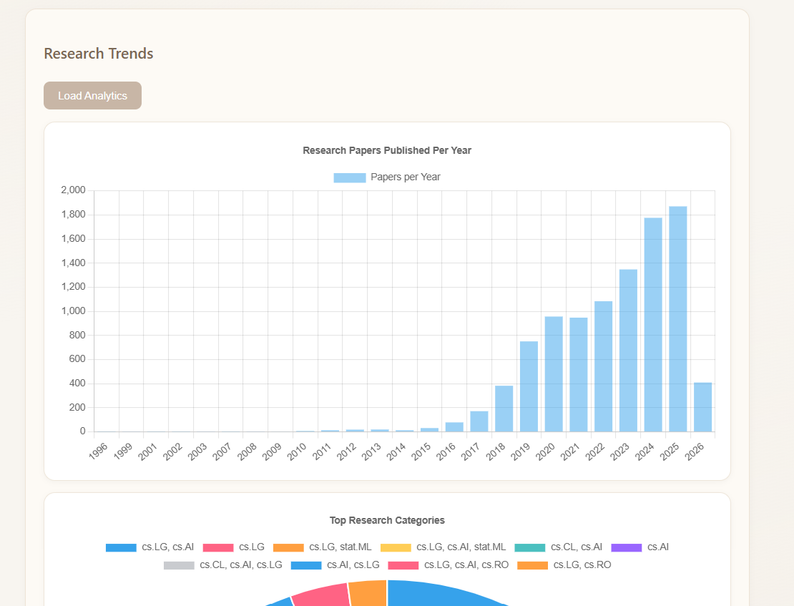

# Research Paper AI Assistant

An end-to-end AI-powered research assistant that enables semantic search, question answering, and analytics over research papers using RAG (Retrieval-Augmented Generation).

This project builds a complete local AI pipeline using embeddings, FAISS vector search, and a local LLM (Ollama) with a custom FastAPI backend and HTML/CSS frontend.

---

# Features

* Semantic research paper search
* AI-powered research question answering (RAG)
* Research paper explanation in simple language
* Research trends analytics dashboard
* FastAPI backend with REST endpoints
* Custom HTML/CSS frontend (no Streamlit)
* FAISS vector database for retrieval
* Local LLM inference using Ollama (phi3 / llama3)
* Loading states and UX improvements
* Error handling and performance optimizations

---

# System Architecture

```
User Interface (HTML/CSS/JS)
            ↓
        FastAPI Backend
            ↓
        RAG Pipeline
            ↓
     Semantic Retrieval (FAISS)
            ↓
     Sentence Embeddings
            ↓
        Research Dataset
            ↓
      Local LLM (Ollama)
```

---

# Screenshots

## Search Papers



## Ask AI



## Explain Paper



## Analytics Dashboard



---

# Tech Stack

Frontend

* HTML
* CSS
* Vanilla JavaScript

Backend

* FastAPI
* Python

AI / ML

* Sentence Transformers
* FAISS
* RAG Pipeline
* Ollama (phi3 / llama3)

Data

* arXiv research papers
* Pandas
* NumPy

Visualization

* Chart.js

---

# Project Structure

```
Research_Paper_AI
│
├── analytics
├── api
├── data
├── embeddings
├── ingestion
├── processing
├── rag
├── retrieval
├── ui
├── vector_store
│
├── README.md
├── requirements.txt
└── PROJECT_PLAN.md
```

---

# API Endpoints

Search Papers

```
POST /search
```

Ask AI

```
POST /ask
```

Explain Paper

```
POST /explain
```

Analytics

```
GET /analytics
```

---

# Example Queries

Search

```
transformer models
graph neural networks
diffusion models
```

Ask AI

```
What are transformers?
How do diffusion models train?
Explain reinforcement learning
```

Explain Paper

```
Attention is all you need
Graph Attention Networks
Transformer architectures
```

---

# Key Capabilities

This project demonstrates:

* Retrieval Augmented Generation (RAG)
* Vector similarity search
* Embedding pipelines
* FastAPI backend design
* Local LLM inference
* AI system architecture
* Frontend + backend integration
* Data analytics dashboard

---

# Future Improvements

* Paper clustering visualization
* User topic recommendations
* Paper summarization
* PDF ingestion
* Deployment (Docker / Cloud)

---

# License

MIT License

---

# Author

Mohd Faizan Khan
AI/ML Engineer | Python | RAG | NLP Systems
